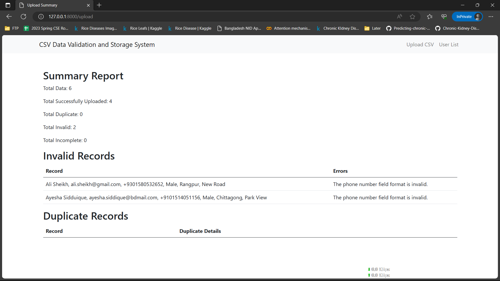

# CSV Data Validation and Storage System

## Description
The User Management System is a web application built using the Laravel framework. It allows users to upload a CSV file containing user data, validate the data based on specified conditions, store the valid data in a database, and provide a summary report of the uploaded data. Users can also view and filter the list of stored users.

## Technologies Used
- Laravel
- Bootstrap
- MySQL

## Installation Instructions
1. Clone the repository to your local machine.
2. Navigate to the project directory.
3. Run the following command to install the dependencies:
   ```
   composer install
   ```
4. Create a new MySQL database for the project.
5. Rename the `.env.example` file to `.env` and update the database connection details.
6. Generate the application key by running the following command:
   ```
   php artisan key:generate
   ```
7. Run the database migrations to create the necessary tables:
   ```
   php artisan migrate
   ```
8. Start the development server:
   ```
   php artisan serve
   ```
9. Access the application by visiting `http://localhost:8000` in your browser.

## Usage
1. Upload CSV File:
   - Visit the homepage of the application.
   - Click on the "Choose File" button to select a CSV file.
   - Click the "Upload" button to process the file.
   - The system will validate the data and provide a summary report.

2. View User List:
   - Click on the "User List" link in the navigation menu.
   - Use the filter form to search for users based on name, email, phone number, and gender.

## Screenshots

*Screenshot 1: Uploading a CSV file.*


*Screenshot 2: Summary report of the uploaded data.*


*Screenshot 3: List of stored users with filtering options.*

## Features
- File upload functionality with CSV validation.
- Storage of validated user data in a database.
- Summary report showing total data, successful uploads, duplicates, invalid records, and incomplete records.
- Filtering of user list based on name, email, phone number, and gender.

## Known Issues
- None at the moment.

## Future Enhancements
- Add pagination to the user list for better performance with a large number of records.
- Implement user authentication and access control for secure data management.
- Provide options for exporting user data in various formats (e.g., CSV, Excel).

## License
This project is licensed under the [MIT License](LICENSE).

## Contact Information
For any inquiries or support, please email [mahidul5130@gmail.com.com](mailto:mahidul5130@gmail.com.com).
