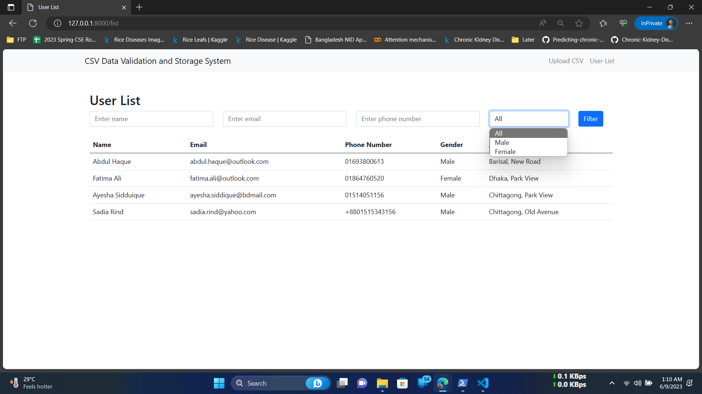

# CSV Data Validation and Storage System

## Description
The CSV Data Validation and Storage System is a web application built using the Laravel framework. It allows users to upload a CSV file containing user data, validate the data based on specified conditions, store the valid data in a database, and provide a summary report of the uploaded data. Users can also view and filter the list of stored users.

## Technologies Used
- Laravel
- Bootstrap
- MySQL

## Installation Instructions
1. Clone the repository to your local machine.
2. Navigate to the project directory.
3. Run the following command to install the PHP dependencies:
   ```
   composer install
   ```
4. Run the following command to install the JavaScript dependencies:
   ```
   npm install
   ```
5. Create a new MySQL database for the project.
6. Rename the `.env.example` file to `.env` and update the database connection details.
7. Generate the application key by running the following command:
   ```
   php artisan key:generate
   ```
8. Run the database migrations to create the necessary tables:
   ```
   php artisan migrate
   ```
9. Build the assets by running the following command:
   ```
   npm run dev
   ```
10. Start the development server:
   ```
   php artisan serve
   ```
11. Access the application by visiting `http://localhost:8000` in your browser.

## Usage
1. Upload CSV File:
   - Visit the homepage of the application.
   - Click on the "Choose File" button to select a CSV file.
   - Click the "Upload" button to process the file.
   - The system will validate the data and provide a summary report.

2. View User List:
   - Click on the "User List" link in the navigation menu.
   - Use the filter form to search for users based on name, email, phone number, and gender.

## Screenshots

*Screenshot 1: Uploading a CSV file.*


*Screenshot 2: Summary report of the uploaded data.*


*Screenshot 3: List of stored users with filtering options.*


*Screenshot 4: Uploading another CSV file.*


*Screenshot 5: Summary report of the another uploaded data.*


*Screenshot 6: List of stored users with filtering options after another upload.*

## Features
- File upload functionality with CSV validation.
- Storage of validated user data in a database.
- Summary report showing total data, successful uploads, duplicates, invalid records, and incomplete records.
- Filtering of user list based on name, email, phone number, and gender.

## File Descriptions and Locations

1. **app\Http\Controllers\UserController.php:**
   - Location: `app\Http\Controllers\UserController.php`
   - Description: This file is located in the `app\Http\Controllers` directory and contains the `UserController` class. It serves as the controller for user-related actions in the application, handling tasks such as rendering views, processing user input, and managing user data.

2. **app\Models\User.php:**
   - Location: `app\Models\User.php`
   - Description: This file is located in the `app\Models` directory and represents the `User` model class. It defines the structure and behavior of the `users` table in the database. The `User` model is responsible for interacting with the `users` table, performing database operations such as retrieving, creating, updating, and deleting user records.

3. **routes\web.php:**
   - Location: `routes\web.php`
   - Description: This file is located in the `routes` directory and contains the web routes for the application. It defines the URL mappings and associates them with the corresponding controller methods. The routes in this file determine how the application handles incoming HTTP requests and routes them to the appropriate controller actions.

4. **resources\views\layouts\app.blade.php:**
   - Location: `resources\views\layouts\app.blade.php`
   - Description: This file is located in the `resources\views\layouts` directory and serves as the main layout template for the application's views. It provides a consistent structure and styling for all pages. The layout includes a navigation bar with links to upload a CSV file and view the user list. The content of each page is dynamically inserted into the designated section using the Blade templating engine. The layout also includes the necessary CSS styling by linking to the Bootstrap CSS file and the Bootstrap JavaScript bundle for interactive components.

5. **resources\views\upload.blade.php:**
   - Location: `resources\views\upload.blade.php`
   - Description: This file is located in the `resources\views` directory and represents the view for uploading CSV files. It displays a form for selecting a CSV file and uploading it to the server. The form is submitted to the designated route for file upload processing.

6. **resources\views\summary.blade.php:**
   - Location: `resources\views\summary.blade.php`
   - Description: This file is located in the `resources\views` directory and represents the view for displaying a summary report after uploading a CSV file. It shows statistics such as the total number of records, successfully uploaded records, duplicate records, invalid records, and incomplete records. It also presents detailed tables for displaying the invalid records and duplicate records with their respective errors and existing user information.

7. **resources\views\list.blade.php:**
   - Location: `resources\views\list.blade.php`
   - Description: This file is located in the `resources\views` directory and represents the view for displaying the user list. It includes a filter form allowing users to search for specific users based on name, email, phone number, and gender. The user records matching the filter criteria are displayed in a table format, showing columns for name, email, phone number, gender, and address.

8. **database\migrations\2023_06_08_141350_create_users_table.php:**
   - Location: `database\migrations\2023_06_08_141350_create_users_table.php`
   - Description: This file is located in the `database\migrations` directory and contains the migration file for creating the `users` table in the database. The migration defines the schema for the `users` table, specifying the columns such as `name`, `email`, `phone_number`, `gender`, `address`, and the timestamps for creation and modification. Running this migration sets up the initial database structure required for storing user information.

## Known Issues
- None at the moment.

## Future Enhancements
- Add pagination to the user list for better performance with a large number of records.
- Implement user authentication and access control for secure data management.
- Provide options for exporting user data in various formats (e.g., CSV, Excel).

## License
This project is licensed under the [MIT License](LICENSE).

## Contact Information
For any inquiries or support, please email [mahidul5130@gmail.com](mailto:mahidul5130@gmail.com).
